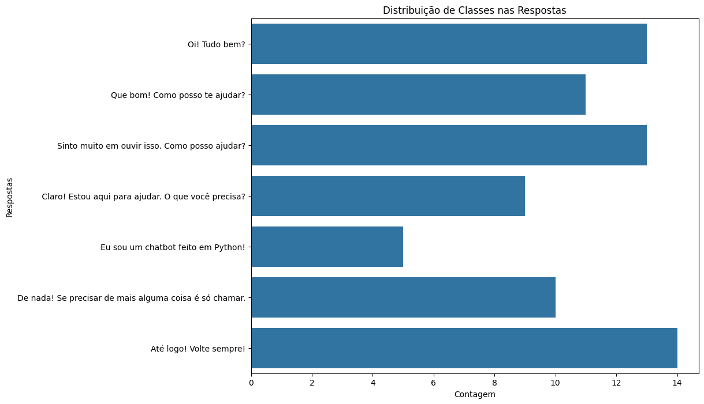
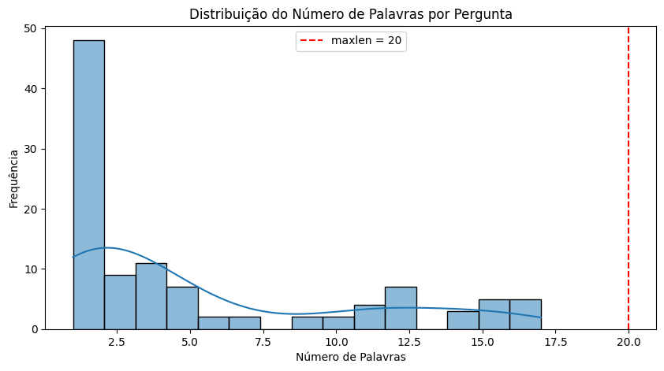
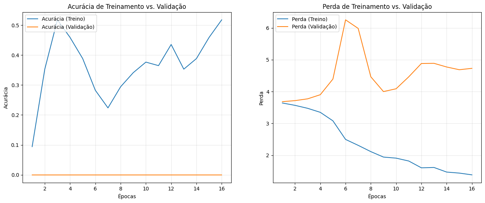
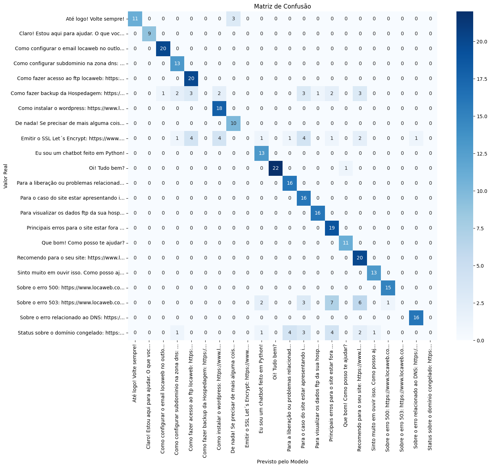

<div align="center">


</div>

# Projeto de Inteligência Artificial (HelpDesk ChatIA)

**Membros:**  

| RA | Integrante | Papel principal |
|------------|----|------------------|
| 2225106566 | Christian Angelo | Documentação / Engenharia de Dados |
| 2225105349 | Denis Dias dos Santos | Documentação / Engenharia de Dados |
| 2225103506 | Miguel Augusto Stanichesqui Torres Nunes | Gerência / Documentação |
| 2225102755 | Nathan Moura Vieira | Apresentação / Modelagem de Dados |
| 2224104454 | Vinicius Amaral dos Santos | Avaliação & Gráficos / Engenharia de Dados |
| 2225102634 | Vinicius Barauna | Avaliação & Gráficos / Modelagem de Dados |

**Apresentação:**  
    Link para a apresentação do projeto de IA:  
    <iframe width="560" height="315" src="https://www.youtube.com/embed/NFU_Q7w7TkM?si=TP_c4aLQB7Z90xNG" title="YouTube video player" frameborder="0" allow="accelerometer; autoplay; clipboard-write; encrypted-media; gyroscope; picture-in-picture; web-share" referrerpolicy="strict-origin-when-cross-origin" allowfullscreen></iframe>
    problema → dados → IA → execução ao vivo → resultados → conclusão.  

**Descrição:**  
A proposta do projeto é o desenvolvimento de uma Inteligência Artificial capaz de auxiliar empresas e startups em duvidas relacionadas a produtos de hospedagem, email e dominios, sanando as principais perguntas antes de qualquer atendimento helpdesk, como se fosse um pré atendimento para estabelecer possiveis soluções sem a necessidade de um atendente.  
***>Aviso:* Atualmente o projeto esta em estado de prototipo, com falhas e diversos erros, pois a base é inferior da esperada e ainda esta decorando ao invés de aprendendo.**

**Decisões Técnicas:**  
Nossa IA é um chatbot em LSTM para compreender e entender as duvidas do cliente independente da forma que indique, para trazer respostas pré-definidas pelo sistema interno afim de agilizar o processo de sondagem, retorno e possivel solução da pergunta ou problema apresentado relacionado a dominio, hospedagem e e-mail profissional na internet. Inicialmente as respostas também deveriam ser definidas com a IA de acordo com regras e uma base em portugues, contudo, se tornou complexo aplicar.  


# Como Instalar:

## Requisitos:
Para o projeto é necessario efetuar a instalação:  
**Versão do Python:** Requer Python 3.12.x ou superior. [python 3.12.10](https://www.python.org/ftp/python/3.12.10/python-3.12.10-amd64.exe)  
**Ambiente Virtual:** (Opcional, mas recomendado como o google colab)  

## Instalar o python
É indicado que seja efetuado a instalação do python dentro de sua maquina ou ambiente virtual.
No site oficial: https://www.python.org

Quando estiver pronto, precisa apenas efetuar o seguinte comando:
```bash
    python --version
```
ou
```bash
    py --version
```

Obs.: Geralmente pode apresentar erro no windows 10 e 11, pois o Aliases de execução do aplicativo esta ligado e precisa desligar.

## Git Clone
Após a instalação do python, é necessário uma copia do projeto em sua maquina, para isso pode simplesmente efetuar o download do arquivo .zip ou efetuar os comando do git caso tenha instalado.

### HTTPS
```bash
    git clone https://github.com/miguelaugusto-bot/ProjetoIA.git
```

### SSH
```bash
    git clone git@github.com:miguelaugusto-bot/ProjetoIA.git
```

## Criar o ambiente virtual
Etapa essencial para isolar as biblioteca de python do projeto, para não misturar com as que possui em sua máquina.  
**Windows**
```bash
    python -m venv .venv

    ou

    py -m venv .venv
```

**Linux / Mac**
```bash
    python3 -m venv .venv
```
## Ativação

**Windows**
```bash
    .venv/Scripts/activate

    ou

    source .venv/Scripts/activate
```

**Linux / Mac**
```bash
    source .venv/bin/activate
```
## Instalar Dependências
Ira efetuar a instalação de todas as bibliotecas que iremos utilizar dentro do projeto.
```bash
    pip install -r requirements.txt
```

## Configuração de Setup
Por fim configurar as pastas ausentes e arquivos que não são capaz de baixar pelo processo habitual do git.
```bash
    python setup.py
```

## Teste
Testar o ambiente inicialmente por python, para verificar se esta tudo funcionando de acordo com o esperado.
```bash
    pytest
```

## Observações Gerais
Toda a parte relacionada diretamente com o jupyter ainda esta sendo testada, e o processo de instalação precisa ser manual, inclusive indicado fortemente a usar um ambiente virtual ou fazer acesso via vscode para a instalação automatica das extensões relacionadas ao jupyter.


# Estrutura do Projeto:

```text
ProjetoIA_2025_Turma41/  
├── data/                  # Dados brutos e externos 
│   ├── dataset.csv        # Perguntas e Respostas para treino  
│   └── cc.pt.300.vec.gz   # Vetores do FastText (baixado pelo setup.py ou pelo treinamento-lstm.ipynb)  
│  
├── models/                # Artefatos treinados (O "Cérebro") 
│   ├── chatbot_lstm_final.keras  # O modelo de Deep Learning salvo  
│   ├── tokenizer.pkl      # Dicionário de palavras  
│   └── label_encoder.pkl  # Tradutor de respostas (IDs -> Texto)  
│  
├── notebooks/             # Área de Experimentação (Jupyter) 
│   ├── treinamento-lstm.ipynb  # Notebook principal de treino  
│   └── exploracao.ipynb        # Notebook para testes manuais rápidos  
│  
├── reports/               # Métricas e Evidências do Treino
│   ├── grafico_acuracia_perca.png          # Mostra que a IA aprendeu (Loss caindo)  
│   ├── balanceamento_classes.png           # Distribuição das perguntas por tema  
│   ├── matriz_confusao.png                 # Onde a IA acertou vs. onde errou  
│   └── balanceamento_de_classes.png        # Precisão detalhada por assunto  
│  
├── src/                   # Código Fonte (Produção)
│   └── bot.py             # Lógica limpa do Chatbot para importação  
│  
├── tests/                 # Testes Automatizados
│   └── test_intencoes.py  # Script de teste (pytest)  
│  
├── requirements.txt       # Lista de bibliotecas necessárias  
├── setup.py               # Script para baixar o FastText e configurar pastas  
└── README.md              # Documentação do projeto  
```


# Dados Utilizados
 
 - **Origem**: Todos os dados utilizados dentro do banco de dados vieram da [registro.br](https://registro.br/ajuda/) e [Locaweb](https://www.locaweb.com.br/ajuda/)
 - **Esquema**: A base de dados é separada por duas colunas, sendo as perguntas(frases frequentes dos usuario) e respostas(retornos objetivos e diretos de acordo com a duvida indicada).
 - **Cuidados éticos/privacidade**: Não possuimos nenhum direito aos dados utilizados e isso é um projeto open-source intuitivo e educacional para a Uninove.


# Resultados

<div align="center">
<h2>Balanceamento de Classes:</h2>
    
    <p><b> O intuito é verificar a quantidade de perguntas possuem a determinada resposta e distribuir da melhor forma a quantidade no momento da aprendizagem. </b></p>
    <br><br>

<h2>Distribuição de Frases:</h2>
    
    <p><b> Verificar a quantidade de palavras possuem ao todo nas perguntas. </b></p>
    <br><br>

<h2>Acurácia e Perca:</h2>
    
    <p><b>São dois gráficos essenciais para a analise de aprendizagem da IA </b></p><br>
    <p><b>Acurácia: Tem o intuito de sondar a precisão da IA dentro do treino e suas validações </b></p>
    <p><b>Perca: Entender se a IA esta aprendendo durante o processo de treino (na situação aplicada, esta apenas decorando ainda)</b></p>
    <br><br>

<h2>Matriz de Confusão:</h2>  
    
    <p><b>O gráfico de matrix de confusão é essencial para entender se a IA estava entendo a relação das perguntas e respostas (entretanto ainda permanece decorando)</b></p>
    <br><br>

<p>Ainda possui muitos residuos e ruidos a serem aplicados que precisam ser corrigidos e analisado, contudo, esse processo será uma feature</p>
</div>


# Créditos

**Autores:**  
Christian Angelo - 2225106566  
Denis Dias dos Santos - 2225105349  
Miguel Augusto Stanichesqui Torres Nunes - 2225103506  
Nathan Moura Vieira - 2225102755  
Vinicius Amaral dos Santos - 2224104454  
Vinicius Barauna - 2225102634  
